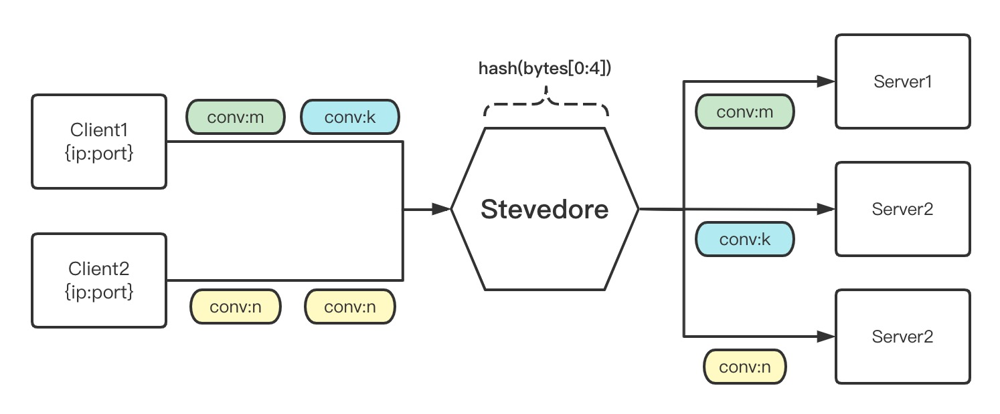
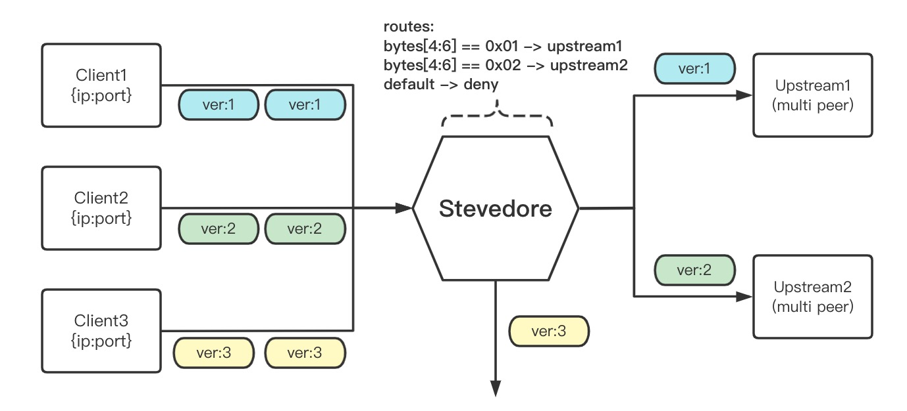

# Stevedore

## 简介
Stevedore 实现了一个四层负载均衡，并且可根据四层数据包的字节内容进行灵活地转发，其主要特点有：

- 四层协议目前支持 UDP，也可应用于 KCP、QUIC、TFTP 协议，或基于 UDP 的一些私有协议
- 数据包的上游选择，支持基于字节进行匹配，甚至基于比特来进行匹配
- 数据包的负载均衡，支持指定的字节作为 hash key
- 通过 epoll 搭配 recvmmsg 对转发效率进行优化，仅用于 linux 系统
- 具有健康检查功能，当节点均不可用时，支持启用某个指定为备用的节点

## 快速开始
### 编译
``` bash
cd ${stevedore_path}
make
mv output/stevedore ${target_dir}
```

### 启动

``` bash
cd ${target_dir}/stevedore
bin/stevedore -c etc/stevedore.config
```

## 最佳实践
### 连接 ID 保持
#### 需求
可应用于带有连接 ID 的协议，比如 KCP、QUIC，其中 KCP 报文结构如下：

```
0               4   5   6       8 (BYTE)
+---------------+---+---+-------+
|     conv      |cmd|frg|  wnd  |
+---------------+---+---+-------+   8
|     ts        |     sn        |
+---------------+---------------+  16
|     una       |     len       |
+---------------+---------------+  24
|                               |
|        DATA (optional)        |
|                               |
+-------------------------------+
```

`conv` 表示连接 ID，占用 4 Bytes 长度，用于维持一个通信 session，已实现可靠性传输的各种处理
因此需要保证具有同一连接 ID 的数据包汇集到同一节点

#### 效果


即使对于同一客户端复用端口来维系两个单独的 KCP 连接，也可以被正常进行转发

#### 配置
``` json
"Upload": {
  "DefaultUpstream": "kcp",         // 默认转发至 kcp Upstream
  "Upstreams": [
    {
      "Name": "kcp",
      "Type": "chash",              // 一致性哈希
      "KeyBytes": "0:4",            // 使用 data[0:4] 来作为 hash key 
      "HealthChecker": {
        "HeartbeatIntervalSec": 5,
        "HeartbeatTimeoutSec": 3,
        "SuccessTimes": 1,
        "FailedTimes": 1
      },
      "Peers": [
        {
          "IP": "10.0.0.1",
          "Port": 2345,
          "Weight": 1,
          "Backup": true
        },
        {
          "IP": "10.0.0.2",
          "Port": 2345,
          "Weight": 1,
          "Backup": false
        },
        {
          "IP": "10.0.0.3",
          "Port": 2345,
          "Weight": 1,
          "Backup": false
        }
      ]
    }
  ]
}
```

### 协议版本兼容
#### 需求
可应用于带有版本的协议，比如对于未实现完全兼容的私有协议，假设私有协议的报文结构如下：

```
0               4       6       8 (BYTE)
+---------------+-------+-------+
|     flag      |  ver  |  cmd  |
+---------------+-------+-------+   8
|            session id         |
+---------------+---------------+  16
|     len       |    checksum   |
+---------------+---------------+  24
|                               |
|        DATA (optional)        |
|                               |
+-------------------------------+
```

在负载均衡的位置，根据数据包的协议版本分发到不同的上游，从而实现协议版本兼容

#### 效果


#### 配置
``` json
"Upload": {
  "DefaultUpstream": "deny",        // 默认丢弃数据包，无此 Upstream
  "Routes": [
    {
      "KeyBytes": "4:6",            // 当 data[0:4] == 0x01 时
      "Operator": "==",             // 转发到 ver1 Upstream
      "Value": "0x01",
      "Upstream": "ver1"
    },
    {
      "KeyBytes": "4:6",            // 当 data[0:4] == 0x02 时
      "Operator": "==",             // 转发到 ver2 Upstream
      "Value": "0x02",
      "Upstream": "ver2"
    }
  ],
  "Upstreams": [
    {
      "Name": "ver1",
      "Type": "rr",
      "HealthChecker": {
        "HeartbeatIntervalSec": 5,
        "HeartbeatTimeoutSec": 3,
        "SuccessTimes": 1,
        "FailedTimes": 1
      },
      "Peers": [
        {
          "IP": "10.0.0.1",
          "Port": 2345,
          "Weight": 1,
          "Backup": true
        },
        ...
      ]
    },
   {
      "Name": "ver2",
      "Type": "rr",
      "HealthChecker": {
        "HeartbeatIntervalSec": 5,
        "HeartbeatTimeoutSec": 3,
        "SuccessTimes": 1,
        "FailedTimes": 1
      },
      "Peers": [
        {
          "IP": "10.0.1.1",
          "Port": 2345,
          "Weight": 1,
          "Backup": true
        },
        ...
      ]
    }
  ]
}
```
